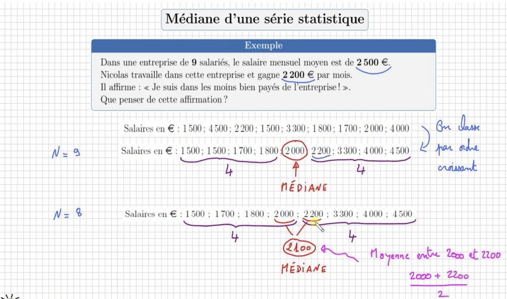
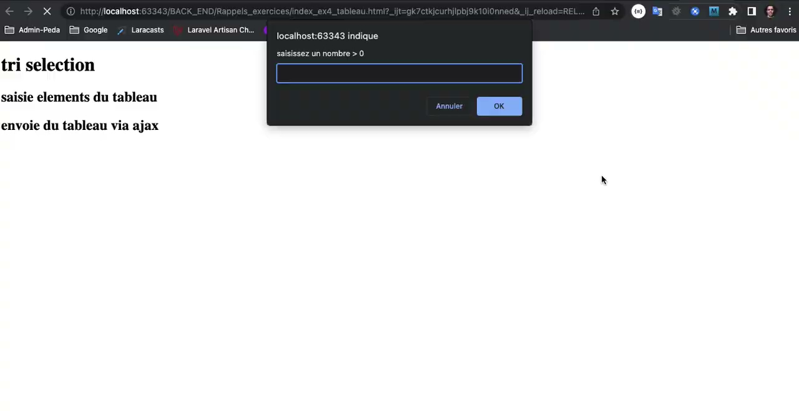

# BTS CIEL // Algorithmique, Python & API REST avec Flask

Bienvenue dans ce cycle de travaux pratiques dédié à l'apprentissage de **Python 3**, des algorithmes statistiques et au développement d'une **API REST avec Flask** adossée à une base de données **MySQL**.

---

## 🛠️ Démarrage rapide de l'environnement

Le projet s'exécute dans une architecture de conteneurs Docker (Nginx, Python 3.12 Flask, MySQL 8.0) :

```bash
# 1. Lancement de la pile Docker
docker compose up -d

# 2. Vérifier que les conteneurs sont actifs
docker compose ps

# 3. Exécuter vos scripts console dans le conteneur Python
docker compose exec api python main.py

# 4. Accéder à l'interface web de test
# Ouvrez votre navigateur sur : http://localhost
```

---

## 📋 Progression des exercices

### Exercice 0.1 : Moyenne et import de module
* **Objectif** : Manipuler une liste Python et créer son premier module réutilisable.
* **Fichiers** : `api/statistique.py`, `api/main.py`.
* **Consignes** :
  * Dans `statistique.py`, codez la fonction `moyenne(tab)`.
  * Ne pas utiliser le module `statistics` : calculez la somme et divisez par le nombre d'éléments.
  * Dans `main.py`, importez `moyenne` et testez-la avec la liste `notes = [12, 15, 8, 19, 10, 14]`.
* **Exemple d'exécution** :
  ```text
  Entrée : [12, 15, 8, 19, 10, 14]
  Sortie attendue : Moyenne = 13.0
  ```
* **Amélioration** : Gérez le cas où la liste passée en paramètre est vide (renvoyez `0.0` sans provoquer de division par zéro).

---

### Exercice 0.2 : Médiane et problème de l'employé Nicolas



> **Problématique de Nicolas :**
> Dans une entreprise de **9 salariés**, le salaire mensuel moyen est de **2 500 €**. Nicolas travaille dans cette entreprise et gagne **2 200 €** par mois.
> Constatant que son salaire est inférieur au salaire moyen (2 200 € < 2 500 €), il affirme : *« Je suis dans les moins bien payés de l'entreprise ! »*.
> Que penser de cette affirmation ?
>
> *Élément d'analyse* : Nicolas commet la confusion fréquente entre **salaire moyen** et **salaire médian**. Quelques très hauts salaires suffisent à tirer la moyenne vers le haut. Pour savoir s'il est réellement dans la tranche inférieure ou supérieure de l'entreprise, il faut ordonner la série et trouver la **médiane** qui sépare l'effectif en deux moitiés égales.

* **Objectif** : Implémenter le calcul de la médiane sur une liste triée et résoudre ce cas concret.
* **Fichiers** : `api/statistique.py`, `api/main.py`.
* **Consignes** :
  * Dans `statistique.py`, codez la fonction `mediane(tab)` sur une série **supposée triée**.
  * Si $N$ est impair, retournez l'élément central à l'indice $N // 2$ ; si $N$ est pair, retournez la moyenne des deux éléments centraux.
  * Dans `main.py`, appliquez le calcul sur les salaires de l'entreprise : `[1500, 4500, 2200, 1500, 3300, 1800, 1700, 2000, 4000]`.
  * Répondez par affichage console : concluez formellement sur la validité de l'affirmation de Nicolas en comparant son salaire à la médiane.
* **Rappel du calcul** :
  * $N = 9$ (impair), série triée : `1500, 1500, 1700, 1800, [2000], 2200, 3300, 4000, 4500` $\rightarrow$ médiane = **2000 €**.
  * $N = 8$ (pair), série triée : `1500, 1700, 1800, [2000 | 2200], 3300, 4000, 4500` $\rightarrow$ médiane = $(2000 + 2200) / 2$ = **2100 €**.
* **Exemple d'exécution** :
  ```text
  Moyenne = 2500.0 € | Médiane = 2000.0 €
  Conclusion : Affirmation fausse (Nicolas gagne 2200 €, soit plus que la médiane de 2000 € ; il fait partie des 50 % les mieux payés).
  ```
* **Amélioration** : Ajoutez une assertion vérifiant que le résultat est identique que la médiane soit calculée sur des entiers ou des flottants.

---

### Exercice 1 : Triangle console et arguments CLI
* **Objectif** : Lire des arguments en ligne de commande et pratiquer les boucles imbriquées ou l'opérateur de chaîne.
* **Fichiers** : `api/triangle.py`.
* **Consignes** :
  * Implémentez la fonction `triangle(n)` qui trace un triangle rectangle d'étoiles de hauteur $n$.
  * Récupérez la valeur de $n$ depuis le terminal via la liste `sys.argv`.
  * Lancez le script via `docker compose exec api python triangle.py 5`.
* **Exemple d'exécution** :
  ```text
  Entrée : 4
  Sortie attendue :
  *
  **
  ***
  ****
  ```
* **Amélioration** : Affichez un message d'aide clair si l'utilisateur oublie de renseigner l'argument sur la ligne de commande.

---

### Exercice 2 : Table de multiplication et alignement
* **Objectif** : Formater l'affichage console sans module tiers à l'aide des f-strings et de `.rjust()` pour aligner les colonnes.
* **Fichiers** : `api/multiplication.py`.
* **Consignes** :
  * Écrivez `multiplication_n_m(n, m)` qui affiche la table complète de $1 \times 1$ jusqu'à $n \times m$.
  * Alignez chaque nombre sur une largeur constante de 4 caractères pour obtenir une grille propre.
* **Exemple d'exécution** :
  ```text
  multiplication_n_m(3, 4)
     1   2   3   4
     2   4   6   8
     3   6   9  12
  ```
* **Amélioration** : Affichez automatiquement une ligne et une colonne d'en-tête séparées par des tirets.

---

### Exercice 3 : Somme et factorielle (Itératif vs Récursif)
* **Objectif** : Comprendre le principe de récursivité et l'empilement d'appels en Python.
* **Fichiers** : `api/recursion.py`.
* **Consignes** :
  * Codez `somme_iterative(n)` puis `somme_recursive(n)` pour calculer $1 + 2 + \dots + n$.
  * Codez `factorielle_iterative(n)` puis `factorielle_recursive(n)` ($n! = 1 \times 2 \times \dots \times n$).
  * Fixez rigoureusement vos cas d'arrêt pour éviter la `RecursionError`.
* **Exemple d'exécution** :
  ```text
  somme_recursive(5) -> 15
  factorielle_recursive(5) -> 120
  ```
* **Amélioration** : Levez une exception `ValueError` explicite si un nombre négatif est transmis.

---

### Exercice 4.1 : Tri par sélection (Valeur vs Référence)
* **Objectif** : Coder un algorithme de tri impératif et maîtriser la mutabilité des listes en Python.
* **Fichiers** : `api/tri_selection.py`, `api/read_tab.py`.
* **Pseudo-code obligatoire** :
```text
procédure tri_selection(tableau t)
    n ← longueur(t)
    pour i de 0 à n - 2
        min ← i
        pour j de i + 1 à n - 1
            si t[j] < t[min], alors min ← j
        fin pour
        si min ≠ i, alors échanger t[i] et t[min]
    fin pour
fin procédure
```
* **Consignes** :
  * Codez `tri_selection_copie(t)` qui retourne une **nouvelle** liste triée sans modifier la liste d'origine.
  * Codez `tri_selection_en_place(t)` qui modifie **directement** la liste en mémoire (passage par référence d'objet mutable).
  * Utilisez `afficher_tableau(t)` depuis `read_tab.py` pour valider l'absence d'effet de bord sur la version par copie.
* **Exemple d'exécution** :
  ```text
  tab_init = [15, 3, 8]
  tri_selection_copie(tab_init) -> retourne [3, 8, 15], tab_init vaut toujours [15, 3, 8]
  tri_selection_en_place(tab_init) -> ne retourne rien, tab_init vaut désormais [3, 8, 15]
  ```
* **Amélioration** : Mesurez le temps d'exécution (`time.perf_counter`) sur une liste de 1 000 entiers aléatoires.

---

### Exercice 4.2 : API REST Flask pour le tri

[](https://drive.google.com/file/d/1_iikt1uk9Wx-tPY79woa0aJHjuJ83r5l/view?usp=drive_link)

* **Objectif** : Concevoir une IHM web en JavaScript pour la saisie dynamique de valeurs, valider l'affichage DOM à l'aide d'un serveur Mock Postman, puis exposer le service web réel en Python avec Flask.
* **Fichiers** : `nginx/html/index.html`, `nginx/html/app.js`, `api/app.py`.
* **Consignes** :
  * **1. Côté Frontend (IHM Web & JavaScript - `index.html`, `app.js`)** :
    * Développez l'interface permettant de saisir les données comme illustré dans la vidéo :
      * **Saisie entier + push** : effectuez le remplissage d'un tableau de valeurs en demandant des entiers à l'utilisateur et en les ajoutant (`push`) tant que la valeur saisie est supérieure à 0 (`valeur > 0`).
      * **Traitement par le service web** : dès qu'une valeur inférieure ou égale à 0 est saisie, transmettez le tableau de valeurs accumulées au service web via une requête `fetch(...)`.
      * **Affichage dans le DOM** : affichez dans la page web le tableau initial saisi, le tableau trié retourné par l'API et la médiane calculée.
  * **2. Simulation avec un serveur Mock Postman (avant le Backend)** :
    * Avant de coder le backend Python, créez un **Mock Server** dans Postman simulant la route `GET /api/tri`.
    * Configurez un exemple de réponse JSON attendue :
      ```json
      {
        "original": [15, 3, 22, 8],
        "tri": [3, 8, 15, 22],
        "mediane": 11.5
      }
      ```
    * Pointez temporairement votre fonction `fetch()` vers l'URL générée par le Mock Postman pour valider le bon fonctionnement de votre IHM et l'injection dans le DOM avant de démarrer le serveur local.
  * **3. Côté Backend (Flask - `app.py`)** :
    * Développez maintenant la route réelle dans l'application Flask :
      * Créez la route `GET /api/tri`.
      * Récupérez la série passée dans la Query String `t` (ex: `/api/tri?t=1500,4500,2200`).
      * Triez le tableau avec votre fonction maison `tri_selection_copie` et calculez la médiane.
      * Renvoyez la réponse JSON structurée : `{"original": [...], "tri": [...], "mediane": 2000.0}`.
    * Reconnectez votre frontend sur l'API Flask locale (`/api/tri?t=...`).
* **Exemple de test curl** :
  ```bash
  curl "http://localhost/api/tri?t=15,3,22,8"
  ```
* **Amélioration** : Renvoyez un code d'erreur HTTP 400 si le paramètre `t` est manquant ou contient des caractères non numériques.

---

### Exercice 4.3 : Client Web Fetch & Salaires aléatoires
* **Objectif** : Connecter une interface web cliente à votre API Flask.
* **Fichiers** : `nginx/html/app.js`.
* **Consignes** :
  * Dans le client web, écoutez le clic sur le bouton `btn-random`.
  * Générez une série de 9 entiers aléatoires compris entre 1200 et 5000.
  * Émettez une requête HTTP vers l'API Flask `/api/tri?t=...`.
  * Affichez la série triée et la médiane renvoyées dans le DOM.
* **Exemple d'exécution** :
  * Clic sur le bouton $\rightarrow$ Les salaires bruts s'affichent, l'API renvoie le tri et la médiane sans rechargement de page.
* **Amélioration** : Animez ou mettez en surbrillance la médiane dans la liste reçue.

---

### Exercice 5 : Fusion de listes (Concaténation)

[](https://www.youtube.com/watch?v=aGkpJFJ9t4k)

* **Objectif** : Traiter plusieurs paramètres de requêtes, manipuler la concaténation de listes avec l'opérateur `+`, et connecter une interface web dynamique pour la saisie et l'affichage.
* **Fichiers** : `api/app.py`, `nginx/html/index.html`, `nginx/html/app.js`.
* **Consignes** :
  * Créez la route `GET /api/fusion?t1=...&t2=...` dans Flask qui concatène les deux séries reçues en utilisant l'opérateur `+`, effectue le tri et calcule la médiane globale.
  * Renvoyez une réponse JSON structurée : `{"t1": [...], "t2": [...], "fusion": [...], "tri": [...], "mediane": ...}`.
  * Développez l'interface web (`index.html` et `app.js`) pour répondre fidèlement au cahier des charges de la vidéo : saisie des deux tableaux dans le formulaire, transmission via `fetch` dans l'URL, récupération des données JSON et affichage dynamique des résultats dans le DOM.
* **Question théorique (à consigner dans votre compte-rendu)** :
  * *Quelle URI et structure de requête devez-vous adopter pour transmettre et fusionner 3 tableaux t1, t2 et t3 ?*
* **Exemple d'exécution** :
  * Requête : `GET /api/fusion?t1=12,18,5&t2=20,8,14`
  * Réponse JSON : `{"fusion": [12, 18, 5, 20, 8, 14], "tri": [5, 8, 12, 14, 18, 20], "mediane": 13.0}`
* **Amélioration** : Rendez votre route capable d'accepter une infinité de tableaux grâce à `request.args.getlist('t')`.

---

### Prérequis à l'Exercice 6 : Les fondamentaux de SQL

> 📖 **Support de cours & exercices préparatoires :**  
> Avant d'interagir avec la base de données depuis votre API Python/Flask, vous devez maîtriser les requêtes SQL indispensables sur la table `employees`.  
> 👉 **Consultez le cours et réalisez les exercices progressifs dans : [`bases en sql.md`](bases%20en%20sql.md)**  
> *(Revenez ensuite ici pour réaliser l'Exercice 6)*

---

### Exercice 6 : Connexion MySQL & Comparaison de salaire
* **Objectif** : Interagir avec une base de données MySQL dans un bloc `try/except` et implémenter des routes métier.
* **Fichiers** : `api/db.py`, `api/app.py`.
* **Consignes** :
  * Dans `db.py`, connectez-vous à la base `CRUD` avec le compte `eleve` / `eleve`.
  * Créez la route `GET /api/salaires/stats` : lit les salaires en BDD et renvoie moyenne et médiane.
  * Créez la route `GET /api/employees/<id>/comparaison` : compare le salaire de l'employé à la moyenne et à la médiane globale (indique si supérieur/inférieur, et l'écart en €).
* **Données de référence BDD** :
  * 6 employés ($N=6$, pair) : 1200, 6500, 8000, 25000, 40000, 100000.
  * Moyenne attendue : **~30 116.67 €** | Médiane attendue : $(8000 + 25000) / 2$ = **16 500.00 €**.
* **Exemple d'exécution** :
  ```bash
  curl "http://localhost/api/employees/3/comparaison"
  # Martin Blank (8000 €) -> Inférieur à la moyenne et inférieur à la médiane.
  ```
* **Amélioration** : Renvoyez une réponse JSON avec code d'état HTTP 404 si l'employé demandé n'existe pas en BDD.
